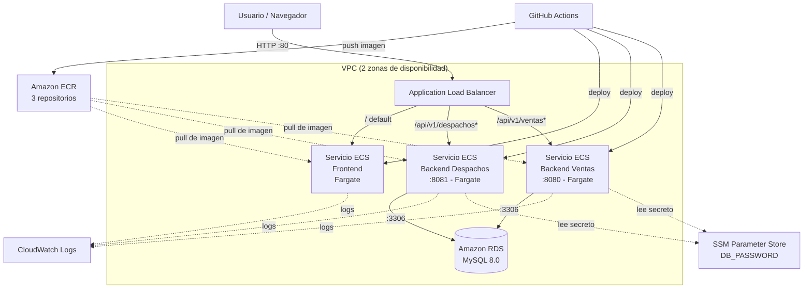

# 1. Arquitectura de la solución

# 1.1 Contexto

La plataforma de Innovatech Chile está compuesta por tres componentes:

- **Frontend** — React (Vite), servido mediante Nginx.
- **Backend de Despachos** — Spring Boot, expuesto en el puerto `8081`.
- **Backend de Ventas** — Spring Boot, expuesto en el puerto `8080`.

Ambos backends se conectan a una única base de datos relacional **MySQL 8.0**, provisionada como instancia Amazon RDS (`db.t3.micro`).

# 1.2 Decisión de arquitectura: ECS Fargate por sobre EKS

La rúbrica permite optar por Amazon ECS o Amazon EKS como servicio de orquestación. Se evaluaron ambas alternativas y se optó por **ECS en modo de ejecución Fargate** (serverless, sin administración de instancias EC2), por las siguientes razones:

1. **Restricción del entorno (AWS Academy Learner Lab):** la cuenta solo permite usar el rol predefinido `LabRole`, sin posibilidad de crear roles IAM personalizados. EKS requiere roles específicos para el clúster y para los nodos que no es posible crear en este entorno.
2. **Menor superficie de configuración:** Fargate elimina la necesidad de aprovisionar y mantener instancias EC2 como nodos del clúster.
3. **Integración nativa:** ECS se integra directamente con Application Load Balancer, Application Auto Scaling y CloudWatch, cubriendo balanceo, autoscaling y logging sin componentes adicionales (a diferencia de EKS, que exigiría Cluster Autoscaler, Ingress Controller, etc.).
4. **Relación costo/beneficio del aprendizaje:** la complejidad adicional de EKS no aportaba valor extra para los objetivos de la evaluación, y sí introducía riesgo de no completar el encargo en el tiempo asignado.

# 1.3 Componentes de la arquitectura

| Componente | Tecnología / Servicio |
|---|---|
| Orquestador | Amazon ECS — modo de ejecución Fargate |
| Registro de imágenes | Amazon ECR (3 repositorios: `front-despacho`, `back-despachos`, `back-ventas`) |
| Balanceo de carga | Application Load Balancer (ALB), ruteo basado en path |
| Base de datos | Amazon RDS para MySQL 8.0 (`db.t3.micro`) |
| Gestión de secretos | AWS Systems Manager Parameter Store (`SecureString`) |
| Observabilidad | Amazon CloudWatch Logs y CloudWatch Alarms |
| Autoscaling | AWS Application Auto Scaling — Target Tracking por CPU |
| CI/CD | GitHub Actions (build → push a ECR → deploy a ECS) |
| Rol de ejecución/tarea | `LabRole` (rol predefinido del entorno AWS Academy) |

# 1.4 Diagrama de arquitectura

# 1.5 Flujo de tráfico

El tráfico de usuarios ingresa por el **Application Load Balancer** en el puerto 80. El listener evalúa reglas de ruteo por path:

- Solicitudes a la raíz (`/`) → servicio **Frontend**.
- Solicitudes a `/api/v1/despachos*` → servicio **Backend de Despachos** (puerto 8081).
- Solicitudes a `/api/v1/ventas*` → servicio **Backend de Ventas** (puerto 8080).

Ambos backends se conectan a la misma instancia de MySQL en Amazon RDS, dentro de la misma VPC. Los tres servicios ejecutan en el clúster ECS Fargate, con sus tareas distribuidas en dos zonas de disponibilidad para alta disponibilidad, y envían sus logs a CloudWatch.
